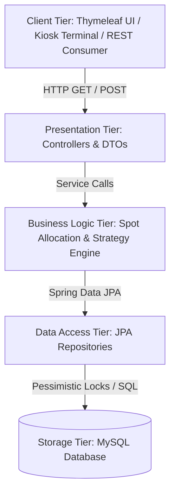

# 🚗 Smart Parking Lot Management System

> **A concurrency-safe, full-stack enterprise parking management platform engineered with Java 21, Spring Boot, Spring Data JPA, and MySQL.**


---

## 📌 Overview

Urban multi-level parking facilities face severe operational bottlenecks: internal lot congestion due to a lack of real-time spot visibility, checkout latency caused by lost tickets, and data corruption from concurrent booking requests.

The **Smart Parking Lot Management System** provides a centralized backend architecture paired with an interactive visual web dashboard. Key engineering highlights include **pessimistic database locking** to prevent race conditions during parallel entry bursts, a **dual-identifier checkout pipeline**, and an extensible **Strategy Pattern** for dynamic tariff calculation and payment routing.

---

## 🚀 Key Features

* **⚡ Automated Nearest-Spot Allocation:** Algorithmic matching that filters spots by vehicle classification (`BIKE`, `CAR`, `TRUCK`) and assigns the closest available bay ordered by level and spot number.
* **🔒 Concurrency Safety & Thread Protection:** Utilizes Spring Data JPA `@Lock(LockModeType.PESSIMISTIC_WRITE)` executing `SELECT ... FOR UPDATE` query boundaries to eliminate double-booking risks under high parallel request loads.
* **🔑 Dual-Identifier Ticket Checkout:** Streamlined exit validation pipeline allowing cashiers or kiosk terminals to resolve active sessions via either a **Ticket ID** or the **Vehicle License Plate Number**.
* **🧩 Strategy Pattern Design:**
  * **Pricing Engine:** Decoupled tariff algorithms (`BasicHourlyRateStrategy`, `PremiumHourlyRateStrategy`) extending `ParkingFeeStrategy`.
  * **Payment Engine:** Polymorphic gateway abstraction (`CashPaymentStrategy`, `UpiPaymentStrategy`, `CardPaymentStrategy`).
* **📊 Real-Time Dashboard UI:** Responsive multi-floor grid interface rendered via Thymeleaf and Tailwind CSS showing live capacity meters and color-coded bay availability (`Green = Available`, `Red = Occupied`).
* **🌐 Hybrid API Boundary:** Dual-capability architecture serving both server-side rendered (SSR) web views and RESTful JSON endpoints (`/api/parking/*`).

---

## 🛠️ Tech Stack & Architecture

### Backend & Database
* **Core Language:** Java 21
* **Framework:** Spring Boot 3.5.13
* **Persistence & ORM:** Spring Data JPA / Hibernate
* **Database Engine:** MySQL 8.0 (Production) / H2 In-Memory (Testing)
* **Utilities:** Lombok, Jakarta Validation

### Frontend
* **Template Engine:** Thymeleaf (Server-Side Rendering)
* **Styling Framework:** Tailwind CSS (Utility-First UI)

### Testing & Verification
* **Frameworks:** JUnit 5, Mockito, Spring MockMvc
* **API Testing:** Postman Test Suite

---

## 📐 System Architecture

### 3-Tier Enterprise Structure



### High-Level Domain Model

```text
+------------------+         +-----------------+         +---------------------+
| ParkingLotEntity | 1 --- * |   LevelEntity   | 1 --- * |  ParkingSpotEntity  |
+------------------+         +-----------------+         +---------------------+
                                                                |         |
                                                           0..1 |         | 1
                                                                v         v
                                                        +---------------+ +--------------+
                                                        | VehicleEntity | | TicketEntity |
                                                        +---------------+ +--------------+
```

### 🛠️ REST API Endpoints

| Method | Endpoint | Description | Request Payload (JSON / Form-Data) |
| :--- | :--- | :--- | :--- |
| `GET` | `/` or `/dashboard` | Renders the live interactive floor grid dashboard | N/A |
| `POST` | `/api/parking/entry` | Allocates nearest spot, reserves bay, and issues UUID ticket | `licenseNumber`, `vehicleType`, `feeStrategy` |
| `POST` | `/api/parking/exit` | Resolves active ticket, calculates fee, and vacates spot | `ticketNumber` (or `licenseNumber`), `paymentMethod` |
| `GET` | `/api/parking/floors` | Returns live capacity metrics across all floor levels | N/A |

## 📂 Project Structure

```text
com.example.SmartParkingLot
├── config/             # Spring bean configuration & strategy wiring
├── controller/         # REST Controllers & Thymeleaf View Controllers
├── dtos/               # Request/Response Data Transfer Objects
├── entities/           # JPA Relational Entities (Lot, Level, Spot, Vehicle, Ticket)
├── enums/              # Domain constants (SpotType, VehicleType, TicketStatus)
├── repository/         # Spring Data JPA Repositories (Pessimistic Locking logic)
├── service/            # Core business domain service interfaces
│   └── serviceImpl/    # Service implementations (@Transactional boundaries)
└── strategy/           # Strategy Pattern implementations (Fee & Payment algorithms)
```

## 🚦 Getting Started

### Prerequisites
* **Java Development Kit (JDK):** Version 21 or higher
* **Build Tool:** Apache Maven 3.8+ (or included Maven Wrapper)
* **Database:** MySQL Server 8.0+

### Installation & Setup

1. **Clone the Repository**
   ```bash
   git clone [https://github.com/your-username/SmartParkingLot.git](https://github.com/your-username/SmartParkingLot.git)
   cd SmartParkingLot
   ```

2. **Configure Database Connection**
   Open `src/main/resources/application.properties` and configure your MySQL credentials:
   ```properties
   server.port=8080

   # Database Configuration
   spring.datasource.url=jdbc:mysql://localhost:3306/parking_lot_db?createDatabaseIfNotExist=true&useSSL=false
   spring.datasource.username=YOUR_MYSQL_USERNAME
   spring.datasource.password=YOUR_MYSQL_PASSWORD
   spring.datasource.driver-class-name=com.mysql.cj.jdbc.Driver

   # JPA / Hibernate Config
   spring.jpa.hibernate.ddl-auto=update
   spring.jpa.show-sql=true
   spring.jpa.properties.hibernate.format_sql=true
   ```

3. **Build the Application**
   ```bash
   mvn clean package -DskipTests
   ```

4. **Run the Application**
   ```bash
   mvn spring-boot:run
   ```

5. **Access the Web Dashboard**
   Open your browser and navigate to `http://localhost:8080`.

---

## 🧪 Running Unit & Integration Tests

The project includes unit tests for isolated business logic (using Mockito) and web slice integration tests (using `@WebMvcTest` and `MockMvc`).

Run the full test suite via terminal:

```bash
mvn test
```

To run a specific test class (e.g., Controller API tests):

```bash
mvn test -Dtest=ParkingLotApiControllerTest
```

---

## 🔮 Future Roadmap

* **[ ] ANPR Integration:** Connect Automatic Number Plate Recognition camera feeds to eliminate manual kiosk input.

* **[ ] Online Reservations:** Expose public REST endpoints for pre-booking spots via a mobile client.

* **[ ] IoT Bay Sensors:** Integrate ultrasonic bay sensors via lightweight MQTT protocols for instant hardware-level occupancy synchronization.

## 📄 License & Author

**Author:** Shagun Kesarwani
